# ImageProcessing

## Grey Image Opeartion

### a. sub-sampling

Implement a function that sub-samples grey level images by a factor n, with n a multiple of 2. The function is able to sub-sample independently in the horizontal and in the vertical direction or in both directions at the same time.

Result of using the following factors: 2 horizontal, 2 vertical, 2 vertical and 8 horizontal, 4 vertical and 4 horizontal:

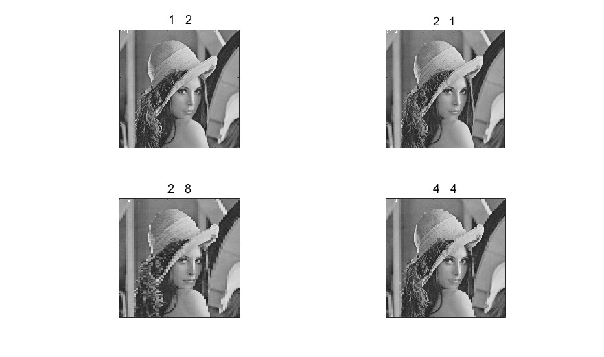

### b. up-sapmling

Scaling-up an image (up-sampling) requires the filling of the new positions given the original pixels. This filling can be obtained by interpolation. Different interpolation techniques can be used. The choice depends on the quality we want to achieve and on the computation resources we have available.

The **nearest-neighbour** interpolation is the simplest and fastest technique, but it is also a technique achieving low quality results. **Bilinear** interpolation is computationally more intensive, but it achieves higher quality results.

The function is able to up-sample independently in the horizontal and in the vertical direction or in both directions simultaneously.

### c. histograms

#### Histogram
A histogram is a statistical representation of the data within an image. The histogram can be represented as a plot of the frequency of occurrence of each grey level. This representation shows the distribution of the image data values. By manipulating a histogram, it is possible to improve the contrast in an image and the overall brightness or to segment different areas of the image by applying one or more thresholds to the histogram itself.

The histogram of grey lena:  
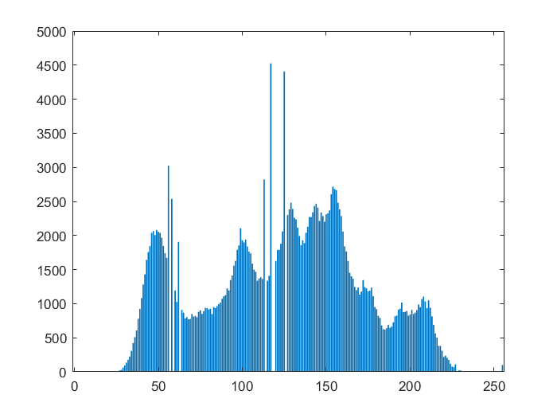

#### Equalization
Equalization is one of the possible image processing algorithms implemented using histograms. Histogram equalization allows a user to enhance the contrast of images. Histogram equalization employs a monotonic, non-linear mapping which re-assigns the intensity values of pixels in the input image such that the output image contains a uniform distribution of intensities (i.e. a flat histogram).

lena histogram after equalization:  
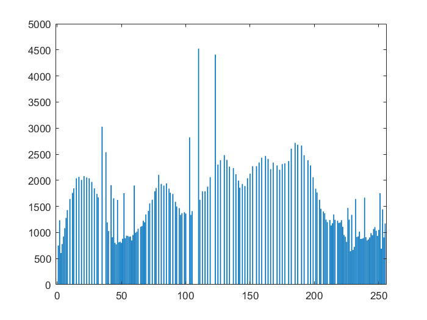

lena equalized:  
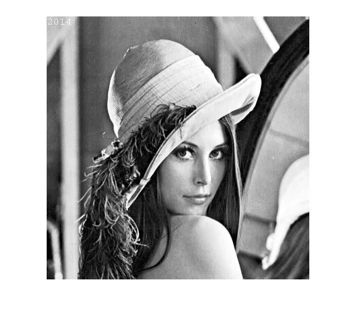

#### Modelling

Histogram modelling techniques are effective tools for modifying the dynamic range and contrast of an image. Unlike contrast stretching, histogram modelling operators may employ non-linear and non-monotonic transfer functions to map between pixel intensity values in the input and output images. In the first part of this lab you will model the histogram of a grey-scale image.

Use as input histogram an approximation of the exponential distribution:

histogram after modelling:  

lena after modelling:  
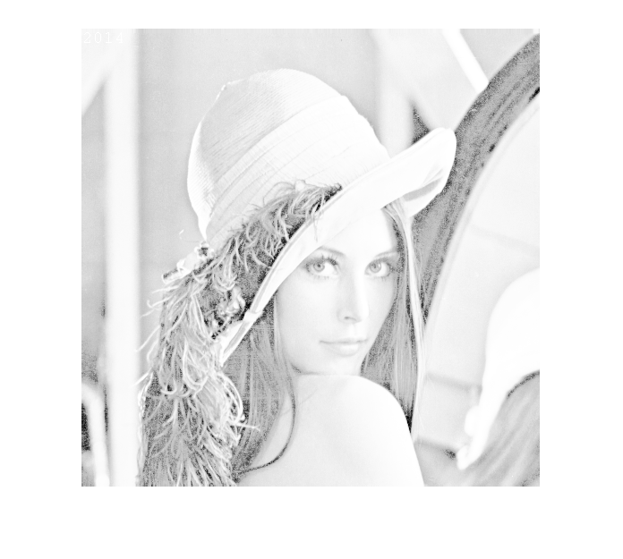

### Quantization

Quantization is the process of approximating the continuous values in the image data with a finite set of discrete values. The input of a quantizer is the original data and the output is one among the finite number of levels. This process is an approximation.

lena quantization factor 2, only has value 128 and 0:  
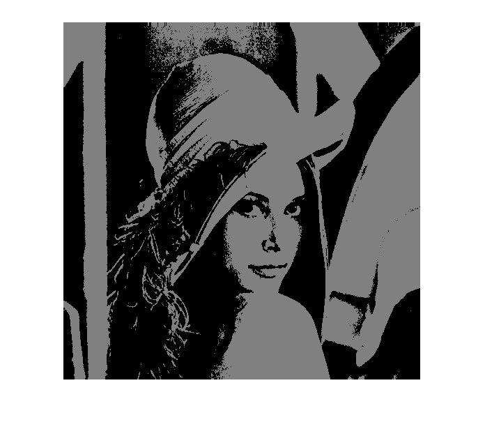

lena quantization factor 8, only has value 0,32,64,96,128,160,192,224:  
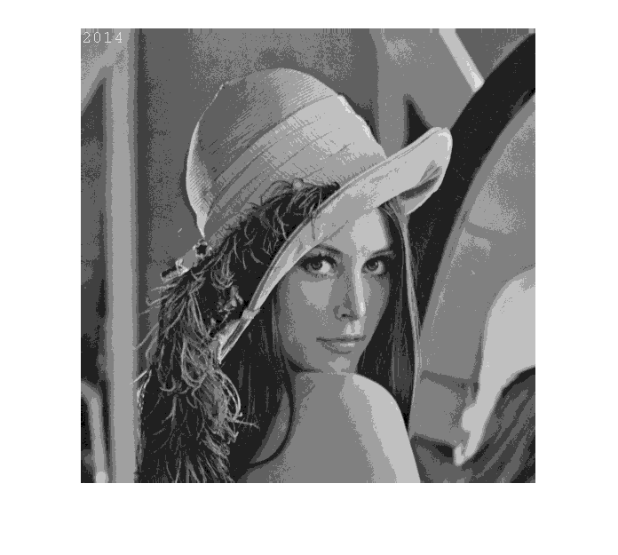

### Rotation

**Inverse warping**

In general, if we map each pixel P = [x,y] to a new position P′= W(x,y), we would end up with holes in the new image!

This can be avoided by using the inverse of the warp W:  
* Loop through all destination pixels [x′,y′];
* Find corresponding source position [x,y] = W−1(x′,y′);
* Find colour f(x′,y′) = f(x,y) by interpolation in source image.

In this implementation I use bilinear interpolation. But remember, interpolation may **blur** the result slightly.

lena rotation (30 degree):  
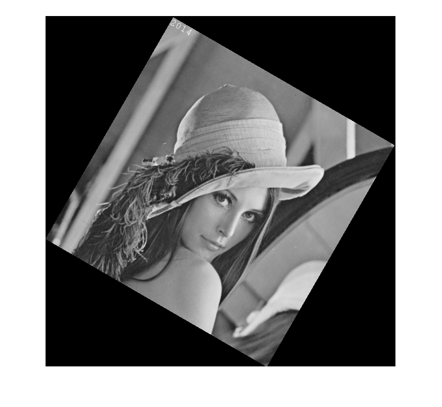

### Skewing

lena skewing (30 degree):  
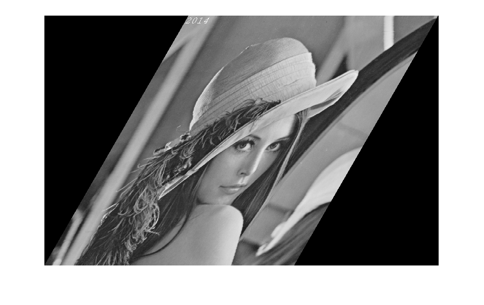

### Edge Detection

Edge detection is the process of identifying and locating discontinuities in an image. The discontinuities are sharp changes in pixel intensity which characterise object boundaries. Classical edge detectors convolve the image with a 2-D kernel designed to be sensitive to large gradient amplitudes. There exist a large number of edge detectors, each designed to be sensitive to certain types of edges.

#### Roberts

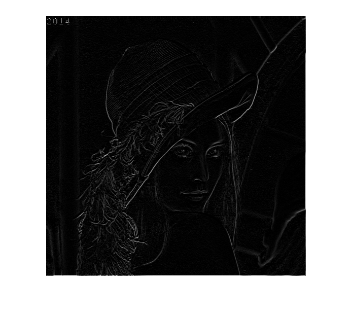

#### Sobel

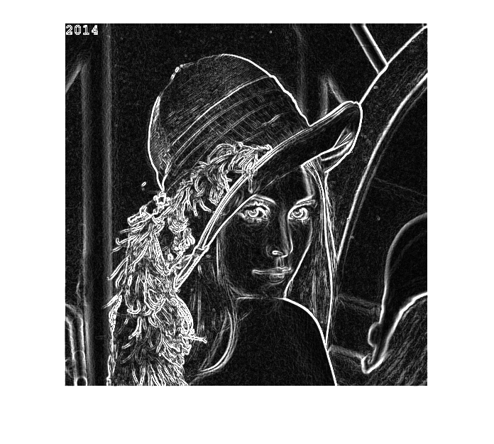

#### Prewit

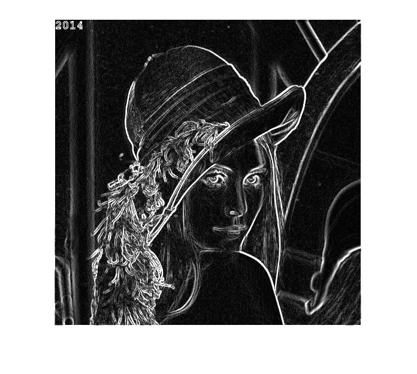

## Colour Image Opeartion

### a. negative

Create the negative of the image (grey or colour):

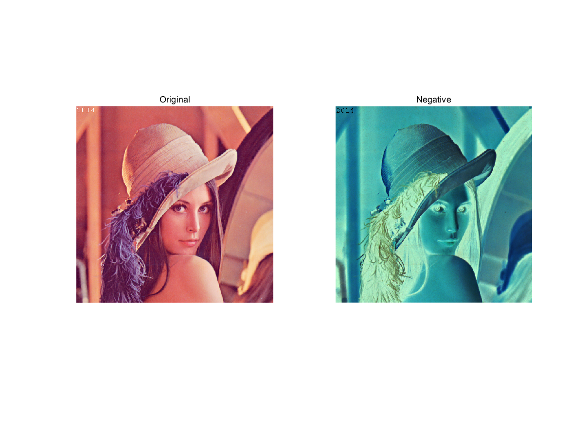

