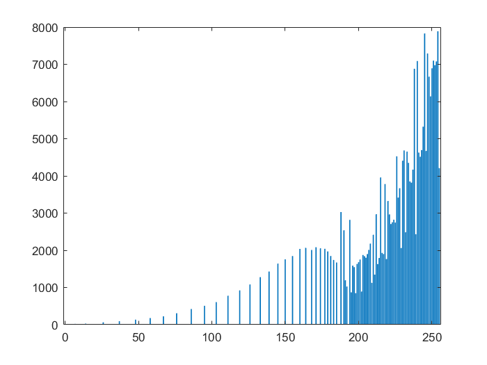

# ImageProcessing

## Grey Image Opeartion

### a. sub-sampling

Implement a function that sub-samples grey level images by a factor n, with n a multiple of 2. The function is able to sub-sample independently in the horizontal and in the vertical direction or in both directions at the same time.

Result of using the following factors: 2 horizontal, 2 vertical, 2 vertical and 8 horizontal, 4 vertical and 4 horizontal:

### b. up-sapmling

Scaling-up an image (up-sampling) requires the filling of the new positions given the original pixels. This filling can be obtained by interpolation. Different interpolation techniques can be used. The choice depends on the quality we want to achieve and on the computation resources we have available.

The **nearest-neighbour** interpolation is the simplest and fastest technique, but it is also a technique achieving low quality results. **Bilinear** interpolation is computationally more intensive, but it achieves higher quality results.

The function is able to up-sample independently in the horizontal and in the vertical direction or in both directions simultaneously.

### c. histograms

#### Histogram
A histogram is a statistical representation of the data within an image. The histogram can be represented as a plot of the frequency of occurrence of each grey level. This representation shows the distribution of the image data values. By manipulating a histogram, it is possible to improve the contrast in an image and the overall brightness or to segment different areas of the image by applying one or more thresholds to the histogram itself.

The histogram of grey lena:  

#### Equalization
Equalization is one of the possible image processing algorithms implemented using histograms. Histogram equalization allows a user to enhance the contrast of images. Histogram equalization employs a monotonic, non-linear mapping which re-assigns the intensity values of pixels in the input image such that the output image contains a uniform distribution of intensities (i.e. a flat histogram).

lena histogram after equalization:  

lena equalized:  

#### Modelling

Histogram modelling techniques are effective tools for modifying the dynamic range and contrast of an image. Unlike contrast stretching, histogram modelling operators may employ non-linear and non-monotonic transfer functions to map between pixel intensity values in the input and output images. In the first part of this lab you will model the histogram of a grey-scale image.

Use as input histogram an approximation of the exponential distribution:

histogram after modelling:  

lena after modelling:  

## Colour Image Opeartion

### a. negative

Create the negative of the image (grey or colour):

